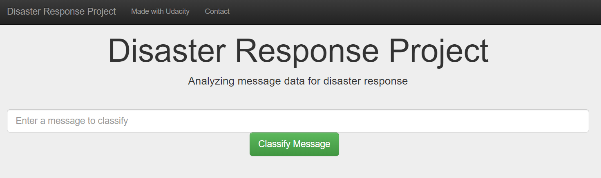
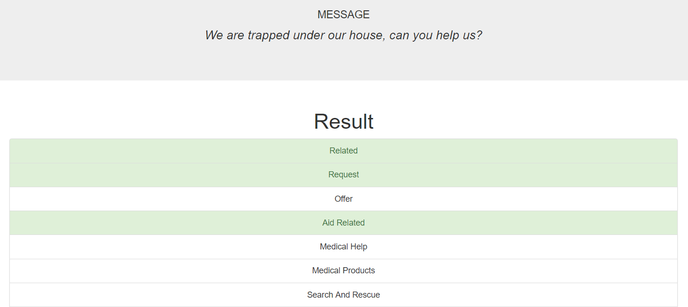
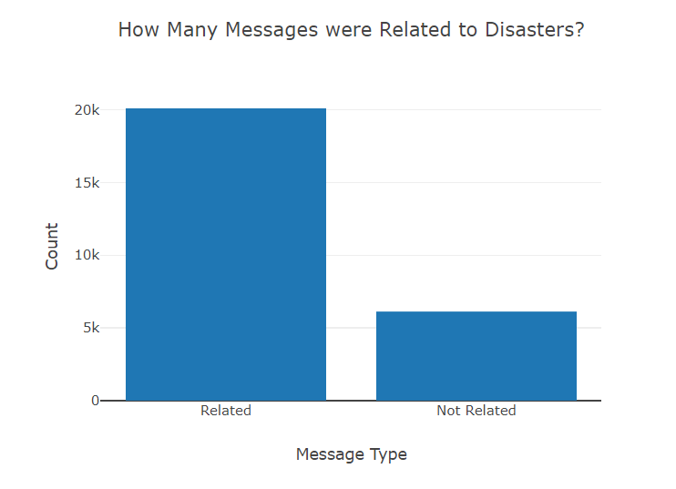
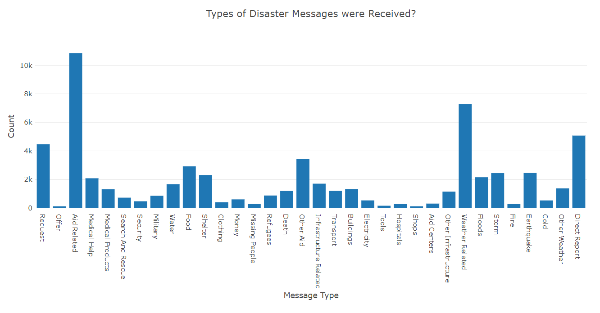
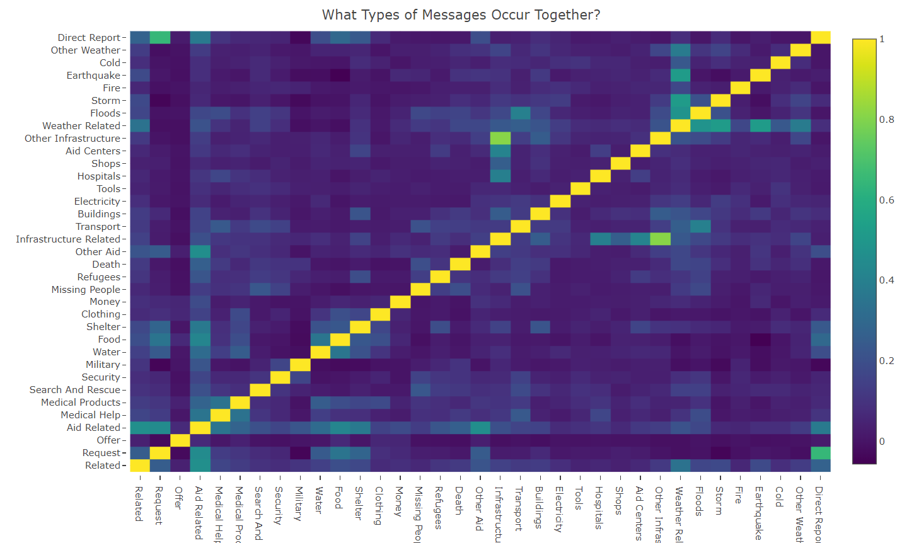

# Disaster Response Pipeline
This project was completed as part of the course requirements of Udacity's [Data Scientist Nanodegree](https://www.udacity.com/course/data-scientist-nanodegree--nd025) certification.

## Overview
The project used a data set from [Figure Eight](https://www.figure-eight.com/) that contained labeled disaster messages received by an aid organization. A multi-output Random Forrest classifier was trained using supervised learning with a natural language processing (NLP). 

An ETL pipeline was created, extracting data from csv files, cleaning and loading into an SQL database. A machine learning pipeline was created to extract the NLP features and then optimize the algorithm using grid search. A web app was then developed that extracts the initial data from the database and provides some interactive visual summaries. Users are also able to enter their own message to be classified by the algorithm.

## Technologies Used
- Python
  - Libraries: pandas, sklearn, sqlite3, sqlalchemy, nltk, plotly, flask
- HTML
  - Bootstrap

## Project Details
### Web App
Users have the ability to enter their own message to be classified. 

They will then be shown the classification results.

They can also see a summary of the original dataset.

### Machine Learning Considerations
One of the primary considerations for this dataset is that the majority of the categories are very imbalanced. In some cases, out of 20k messages, only a few hundred messages exist under a specific classification. Attempts were made to manage this by using the f1-score as the metric to train the algorithm with 'micro' averaging. 

Further work could be done to develop the algorithm by using anomaly detection machine learning techniques. 
